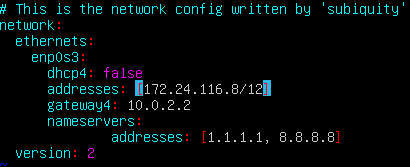
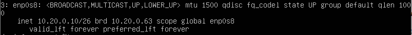
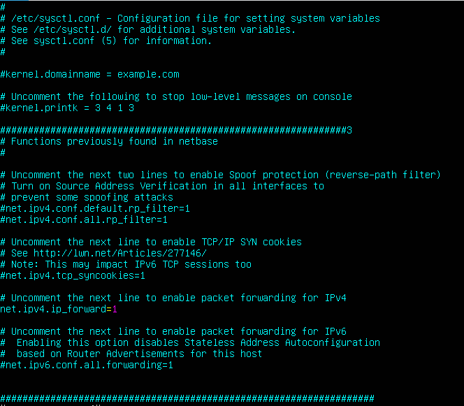
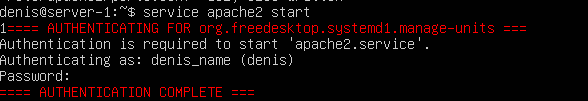
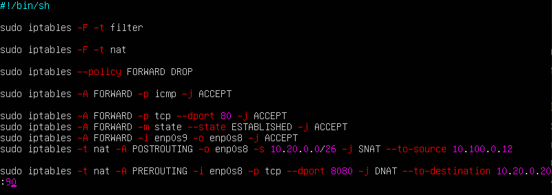

## Part 1. ipcalc tool

### Часть 1.1: Networks and Masks

Чтобы установить ipcalc нужно выполнить команду в терминале:
```bash
sudo apt install ipcalc
```

- Определим и запишем следующие адреса:

1. 192.167.38.54/13


2. Конвертация следующих масок:
- 255.255.255.0 в префиксный и бинарный вид: 


Префиксный вид:  /24

Бинарный вид: 11111111.11111111.11111111.00000000
- /15 в нормальный и бинарный вид


- 11111111.11111111.00000000.11110000 в префиксный и нормальный вид


Префиксный вид: /28

Нормальный вид: 255.255.255.240

3. Вывод минимального и максимального хостов:

- адрес 12.167.38.4 с маской /8


- адрес 12.167.38.4 с маской /16


- адрес 12.167.38.4 с маской /23


- адрес 12.167.38.4 с маской /4


### Часть 1.2: localhost

- localhost (так называемый, «местный» от англ. local, или «локальный хост», по смыслу — этот компьютер) — в компьютерных сетях, стандартное, официально зарезервированное доменное имя для частных IP-адресов в диапазоне 127.0.0.1 — 127.255.255.254. Для сети, состоящей только из одного компьютера, как правило, используется всего один адрес — 127.0.0.1, который устанавливается на специальный сетевой интерфейс «внутренней петли» (англ. loopback) в сетевом протоколе TCP/IP. 

- Определите и запишите в отчете, можно ли получить доступ к приложению, работающему на локальном хосте, со следующих IP-адресов:

- Соответсвенно адреса ненаходящиеся в диапозоне 127.0.0.1 - 127.255.255.254, работающие на localhost не могут получить доступ к приложению

- 194.34.23.100


Нет, нельзя так как отсутсвует вывод слова loopback

- 127.0.0.2


Можно, так как присутствует вывод слова loopback

- 127.1.0.1


Можно, так как присутствует вывод слова loopback

- 128.0.0.1


Нет, нельзя так как отсутсвует вывод слова loopback

### Часть 1.3: Network ranges and segments

Существует классификация IP-адресов на «частные» и «публичные». Следующие диапазоны адресов зарезервированы для частных (локальных) сетей:
- *10.0.0.0* — *10.255.255.255* (*10.0.0.0/8*),
- *172.16.0.0* — *172.31.255.255* (*172.16.0.0/12*),
- *192.168.0.0* — *192.168.255.255* (*192.168.0.0/16*).
- *127.0.0.0* — *127.255.255.255* 

(Зарезервировано для интерфейсов обратной связи (не используется для связи между узлами сети), так называемый локальный хост)

1. Какие из перечисленных IP-адресов можно использовать как публичные, а какие только как частные:

- 10.0.0.45 - Private


- 134.43.0.2 - Public


- 192.168.4.2 - Private


- 172.20.250.4 - Private


- 172.0.2.1 - Public


- 192.172.0.1 - Public


- 172.68.0.2 - Public


- 172.16.255.255 - Private


- 10.10.10.10 - Private


- 192.169.168.1 - Public


2. Какие из перечисленных IP-адресов шлюза возможны для сети 10.10.0.0/18:

Шлюзы возможные для этой сети находятся между hostmin и hostmax


- 10.0.0.1 - Возможен

- 10.10.0.2 - Возможен 

- 10.10.10.10 - Возможен 

- 10.10.100.1 - Невозможен 

- 10.10.1.255 - Невозможен 


## Part 2. Static routing between two machines

- Вызов и вывод коамнды ip a : 

- ws1:


- ws2:


- Описание сетевого интерфейса с помощью команды ip link show

-ws1


-ws2


- Задание адресов и масок :

-ws1 192.168.100.10/16


-ws2 192.168.100.10



- После этого сохраняем командой 

```bash
sudo netplan aplly
```

- Команда нечего не выводит


### Part 2.1: Adding a static route manually

Прежде чем пропинговать надо поменять структуру файла etc/netplan/00-installer-config.yaml file:

- ws1 : 


- ws2 : 


- Добавить статический маршрут от одной машины до другой и обратно при помощи команды вида ip r add :

- ws1 : 


- ws1 : 


- Пропингуем соединение между машинами :

- ws1 :


- ws2 :


### Part 2.2: Adding a static route with saving

- перезапустить машины можно поменять командой: 

```bash
reboot
```

- Добавить статический маршрут от одной машины до другой с помощью файла etc/netplan/00-installer-config.yaml:

- ws1 : 


- ws2 : 


- Пропинговать соединение между машинами :

- ws1 : 


- ws2 : 


## Part 3: iperf3 utility

### Part 3.1: Connection speed

- 8 Mbps -> MB/s = 1

- 100 MB/s -> kbps/s = 800000

- 1 Gbps -> Mbps = 1000000

### Part 3.2: iperf3 utility

- Чтобы установить iperf3 введем команду :

```bash
sudo apt install iperf3
```

- Измерение скорости соединения между ws1 и ws2:

- Чтобы измерить скорость нам нужно создать клиент и сервер, куда будут посылаться запросы:

- Чтобы создать сервер на ws2 введем команду : 

```bash
iperf3 -s
```

- Сервер на начинает прослушивает порт 5201:


- Чтобы послать запросы на сервер ws2, на ws1 нужно ввести команду : 


- Скорость соединения приблизительно равна 330340 KBytes/sec

## Part 4: Network firewall

### Part 4.1: iptables utility

- Создать файл /etc/firewall.sh, имитирующий фаерволл, на ws1 и ws2

- ws1 :


- ws2 :


- Запустить файлы на обеих машинах командой :

```bash
sudo chmod +x /etc/firewall.sh
```

- ws1 :


- ws1 :


- Затем запустить скрипты командой :

```bash
sudo /etc/firewall.sh
```

- ws1 :


- ws1 :


- Разница между стратегиями, применёнными в первом и втором файлах, заключается в том, что на первой машине сначала запрещено отвечать на приходящие пакеты через echo reply, а потом разрешается. На 2 машине эти действия выполняются в противоположном порядке.

### Part 4.2: nmap utility

- машина ws1 не пингуется с ws2:


- вывод команды nmap на ws1 :


## Part 5: Static network routing

### Part 5.1: Configuration of machine addresses

- скрины с содержанием файла etc/netplan/00-installer-config.yaml для каждой машины:

- ws11 


- r1


- r2


- ws21


- ws22


- Перезапустить сервис сети

- ws11 


- r1


- r2


- ws21


- ws22


- командой ip -4 a проверить, что адрес машины задан верно :

- ws11 


- r1


- r2


- ws21



- ws22


-  Пропинговать :

1. ws22 с ws21


1. r1 с ws11


### Part 5.2: Enabling IP forwarding

- Для включения переадресации IP, выполните команду на роутерах:

```bash
sysctl -w net.ipv4.ip_forward=1
```

- r1:


- r2:


- Окрытие файла /etc/sysctl.conf и добавление в него следующую строку: net.ipv4.ip_forward = 1

- r1:



- r2:


### Part 5.3: Default route configuration

- Настроить маршрут по-умолчанию (шлюз) для рабочих станций. Для этого добавить default перед IP роутера в файле конфигураций:

- ws11 


- ws21


- ws22


- r1


- r2


- Вызвать ip r и показать, что добавился маршрут в таблицу маршрутизации

- ws11 


- ws21


- ws22


- Пропинговать с ws11 роутер r2 и показать на r2, что пинг доходит. Для этого использовать команду:

```bash
tcdump -tn -i ethl
```

- ws11 -> r2


- r2 :


### Part 5.4:  Adding static routes

- Добавить в роутеры r1 и r2 статические маршруты в файле конфигураций

- r1 :


- r2 :


- Вызвать ip r и показать таблицы с маршрутами на обоих роутерах.

- r1 :


- r2 :


- Запустить команды на ws11:

```bash
ip r list 10.10.0.0/[маска сети]
```

- с маской 18


- с маской 0


- В отчете выбран путь отличный от 10.10.0.0 потому что этот адрес указывает на все адреса.

### Part 5.5: Making a router list

- Установить утилиту traceroute следующей командой ws11 :

```bash
sudo apt install traceroute
```

- Запустить на r1 команду дампа :

```bash
tcdump -tnv -i enp0s8
```


- Запустить на ws1 traceroute :

```bash
traceroute 10.20.0.10
```


### Part 5.6: Using ICMP protocol in routing

- Запустить на r1 перехват сетевого трафика, проходящего через eth0 с помощью команды :

```bash
tcpdump -n -i enp0s8 icmp
```


- Пропинговать с ws11 несуществующий IP (например, 10.30.0.111) с помощью команды:

```bash
ping -c 1 10.30.0.111
```


## Part 6: Dynamic IP configuration using DHCP

- Для r2 настроить в файле /etc/dhcp/dhcpd.conf конфигурацию службы DHCP:

1) Указать адрес маршрутизатора по-умолчанию, DNS-сервер и адрес внутренней сети. 


2) В файле resolv.conf прописать nameserver 8.8.8.8.


- Перезагрузить службу DHCP командой:

```bash
systemctl restart isc-dhcp-server
```


- На машине ws21 изменить файл конфигурации:


- Машину ws21 перезагрузить при помощи reboot и через ip a показать, что она получила адрес:


- Пропинговать ws22 с ws21 :


- Указать MAC адрес у ws11, для этого в etc/netplan/00-installer-config.yaml надо добавить строки: 


- Также задать macaddress в настройках сети: 


- Для r1 настроить аналогично r2, но сделать выдачу адресов с жесткой привязкой к MAC-адресу (ws11). Провести аналогичные тесты.

- Установка dhcp

```bash
sudo apt-get install isc-dhcp-server
```

- Настроить конфигурацию файла /etc/dhcp/dhcpd.conf на r1 :


- Вносим извинения в /etc/resolv.conf : 


- Перезагрузить службу DHCP командой:

```bash
systemctl restart isc-dhcp-server
```

- Машину ws11 перезагрузить при помощи reboot и через ip a показать, что она получила адрес:


- Запросить с ws21 обновление ip адреса командой :

```bash
sudo dhclient enp0s8
```


## Part 7: NAT

- Установить apache2 командой :

```bash
sudo apt install apache2
```

- В файле /etc/apache2/ports.conf на ws22 и r1 изменить строку Listen 80 на Listen 0.0.0.0:80, то есть сделать сервер Apache2 общедоступным :

- ws22 :


- r1 :


- Запустить веб-сервер Apache командой : 

```bash
service apache2 start
```

- ws22 : 


- r1 : 



- Добавить в фаервол, созданный по аналогии с фаерволом из Части 4, на r2 следующие правила :


- Запускать файл также, как в Части 4 :

```bash
sudo chmod +x /etc/firewall.sh
```

- Проверить соединение между ws22 и r1 командой ping. При запуске файла с этими правилами, ws22 не должна "пинговаться" с r1. 


- Разрешить маршрутизацию всех пакетов протокола ICMP :


- Проверить соединение между ws22 и r1 командой ping. При запуске файла с этими правилами, ws22 должна "пинговаться" с r1 :


- Добавить в файл ещё два правила:

`5) включить SNAT, а именно маскирование всех локальных ip из локальной сети, находящейся за r2 (по обозначениям из Части 5 - сеть 10.20.0.0)`

`6) включить DNAT на 8080 порт машины r2 и добавить к веб-серверу Apache, запущенному на ws22, доступ извне сети`



- `iptables -A FORWARD -p tcp --dport 80 -j ACCEPT` - Правило позволяет принять и перенаправить входящий TCP-трафик на порту 80 системы.
    - `-A FORWARD` - Цепочка FORWARD в iptables является одной из трех стандартных цепочек iptables, которые применяются для обработки сетевого трафика. Она используется для принятия решений о перенаправлении пакетов между различными сетевыми интерфейсами на системе. Опция -A в команде iptables указывает на добавление нового правила в указанную цепочку. В данном конкретном случае, -A FORWARD указывает, что новое правило будет добавлено в цепочку FORWARD.
    - `-p tcp` - Опция -p указывает протокол как TCP
    - `--dport 80` - Указывает порт назначения как 80
    - `-j ACCEPT` -  Означает принять трафик
- `iptables -A FORWARD -m state --state ESTABLISHED -j ACCEPT` - Эта команда добавляет правило в цепочку FORWARD в iptables для принятия всех установленных соединений.
  - `-m state` - Модуль state позволяет определить состояние соединения, такое как NEW (новое соединение), ESTABLISHED (установленное соединение), RELATED (связанное соединение) и INVALID (недопустимое соединение).
  - `--state ESTABLISHED` - Указывает, что правило будет применяться только к пакетам, которые относятся к установленным соединениям. Это означает, что пакеты, которые уже установили соединение (например, пакеты ответа на уже существующий запрос), будут приняты и разрешены проходить через цепочку FORWARD.
- `iptables -A FORWARD -i enp0s9 -o enp0s8 -j ACCEPT` - Разрешает пересылку пакетов, которые поступают на интерфейс enp0s9 и отправляются на интерфейс enp0s8
  - `-i enp0s9` - Параметр указывает, что это входящий интерфейс для пакетов, т.е. это интерфейс, с которого пакеты поступают в систему. То есть пакеты отправляются с enp0s9.
  - `-o enp0s8` - Параметр указывает, что это исходящий интерфейс для пакетов, т.е. это интерфейс, через который пакеты будут отправляться из системы. То есть пакеты отправляются к enp0s8.
- `iptables -t nat -A POSTROUTING -o enp0s8 -s 10.20.0.0/26 -j SNAT --to-source 10.100.0.12` - Данное правило настраивает NAT и позволяет заменять исходные адреса пакетов из подсети 10.20.0.0/26 на адрес 10.100.0.12 перед отправкой этих пакетов через интерфейс enp0s8.
  - `-t nat` - Параметр, указывающий на использование таблицы nat. Таблица nat используется для настройки преобразования адресов в сети.
  - `-A POSTROUTING` - Параметр, указывающий, что правило будет применяться к цепочке POSTROUTING. Цепочка POSTROUTING используется для обработки пакетов после прохождения маршрутизации.
  - `-s 10.20.0.0/26` - Параметр указывает на исходный (исходящий) адрес пакетов, которые будут подвергнуты преобразованию адреса.
  - `-j SNAT --to-source 10.100.0.12` - Параметр указывает на действие, которое должно быть применено для пакетов, соответствующих этому правилу. В данном случае, это преобразование исходящего адреса пакетов в 10.100.0.12. То есть, пакеты, проходящие через enp0s8 и имеющие исходящий адрес в подсети 10.20.0.0/26, будут заменяться адресом 10.100.0.12 перед отправкой дальше по сети.
- `iptables -t nat -A POSTROUTING -i enp0s8 -p tcp --dport 8080 -j DNAT --to-destination 10.20.0.20:80` - Данное правило NAT позволяет перенаправить входящие пакеты на интерфейс enp0s8 с портом назначения 8080 на IP-адрес 10.20.0.20 с портом 80. Это может быть полезно в случае, когда необходимо переадресовать веб-трафик на конкретный веб-сервер внутри сети.
  - -`A POSTROUTING` - Параметр, указывающий, что правило будет применяться к цепочке POSTROUTING. Цепочка POSTROUTING используется для обработки пакетов после прохождения маршрутизации.
  - `-i enp0s8` - Параметр указывает на входящий интерфейс пакетов, т.е. интерфейс, с которого пакеты поступают в систему. В данном случае, это интерфейс enp0s8.
  - `--dport 8080` - Параметр указывает на порт назначения пакетов. В данном случае, пакеты, имеющие назначенный порт 8080, будут подвергаться преобразованию.
  - `-j DNAT --to-destination 10.20.0.20:80` - Параметр указывает на действие, которое должно быть применено для пакетов, соответствующих этому правилу. В данном случае, это преобразование адреса назначения пакетов на 10.20.0.20 с портом 80. То есть, пакеты, поступающие на интерфейс enp0s8 с портом назначения 8080, будут переадресованы на IP-адрес 10.20.0.20 с портом 80.


- Проверить соединение по TCP для SNAT, для этого с ws22 подключиться к серверу Apache на r1 командой:


- Проверить соединение по TCP для DNAT, для этого с r1 подключиться к серверу Apache на ws22 командой telnet (обращаться по адресу r2 и порту 8080) :


## Part 8. Bonus. Introduction to SSH Tunnels


- Запустить на r2 фаервол с правилами из Части 7 :


- Запустить веб-сервер Apache на ws22 только на localhost (то есть в файле /etc/apache2/ports.conf изменить строку Listen 80 на Listen localhost:80) : 


- На ws22 необходимо установить ssh сервер :

```bash
sudo apt install openssh-server
```

- Воспользоваться Local TCP forwarding с ws21 до ws22, чтобы получить доступ к веб-серверу на ws22 с ws21 :


- Для проверки, сработало ли подключение, перейдите во второй терминал (например, клавишами Alt + F2) и выполните команду:


- Воспользоваться Remote TCP forwarding c ws11 до ws22, чтобы получить доступ к веб-серверу на ws22 с ws11 :


- Для проверки, сработало ли подключение, перейдите во второй терминал (например, клавишами Alt + F2) и выполните команду:

